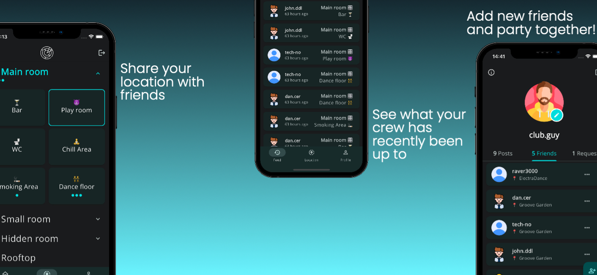

# Party Radar App

## Project purpose

This app is a project in production, thus available to download 
from the official stores. 
It is supposed to help people who go to parties at bigger locations 
find each other.

## Available functions

* share current location (create a new post)
* get feed with friends' location posts
* add/delete friends
* add/delete posts in history
* create/update/delete account and account infos like:
  * username
  * profile picture
* create and edit locations

## Frontend

A Flutter application for Android and iOS devices. 
The application contains of 3 main screens: feed, location scheme and user page.

### Feed

Feed contains posts of friends at the currently selected location. Feed is not available as long as 
no location is selected. It is possible to see all the posts of friends that have ever been posted
at the location. If post was created via dialog with radio selection, an arrow on the post is active
to be able to see the exact location of the one who posted.

### Location

By default, no location is selected. To select ione, the drawer has to be opened via the upper left button.
The drawer contains list of locations with the nicknames of people who created those. If you have 
created some locations but haven't made them available yet, they will also be shown. Locations approved as
official by admin have a tick on the left.

After a location is selected, it is visible as a multi-level scheme. 

#### 1st level
1st level is dropdowns or list tiles. Number of friends currently checked-in at the corresponding tile is shown by
little blue circles under the name. If list tile doesn't have any sub-locations, a dialog for posting location opens 
on click. Otherwise, a dropdown is unwrapped

#### 2nd level
2nd level is visible when a dropdown is clicked and unwrapped. It consists of cards with names of sub-locations of the 
dropdown. Each card also shows number of friends at the location the same way dropdown does. If card doesn't have any
sub-locations, dialog window opens which leads to posting the selected location.

#### 3rd level
3rd level is visible when a card is clicked which contains sub-locations. 3rd level is a dialog window, which consists
of a picture (scheme) of selectable sub-locations and radio buttons with names, which correspond to locations on the
picture. After selecting a radio and approving it, a post with your current location will appear in the feed. If no
radio button was selected but you've decided to post the location, the location from card will be posted.

### Location editing

Location editing page is kind of a constructor which you can use to build your own location, which you and your friends
can use later. Only the author of the location is allowed to edit it. When you get into location editing mode, first 
thing you see is input fields which correspond to list tiles. You can add either a list tile or a dropdown using buttons
on the lower part of the screen. Each added tile can be disabled, so that it is not visible in normal mode. Tiles can 
also be deleted.
In the top middle of the screen is the name of location which appears in the location selection drawer.
When unwrapping a dropdown, you see a card with plus. On click, you can add a sub-location. A dialog opens where you can
input the name for the new location. The card is first marked as disabled until you enable it. To edit the card and all
its sub-locations, just click on it. A new screen opens with all the available card settings.

#### Card settings

Card settings contain 2 input fields: card emoji (optional, shown on top) and card title (mandatory, shown on the bottom).
There are also 3 switches: 
1. Location enabled - this enables the card and makes it visible in the list outside of edit mode.
2. Is closeable - this enables the closeable functionality (which you can call in normal mode by long tapping the card).
3. Dialog enabled - this turns the card into the mode where you can add sub-locations to it. A dialog opens on card click.

#### Card dialog settings

Card dialog settings help you set up the dialog which opens when a card is clicked in normal mode. There are
multiple settings here:
1. Dialog name - a name shown in the top middle of the card.
2. Dialog image - an image shown in the card (usually a scheme of sub-locations).
3. Schema (mandatory) - a constructor of scheme, which looks like a 2D list of radio buttons with names which correspond
to locations from the image (normally, if you have one).
4. Selectable capacity - if selected, a capacity selection toggle is visible in the dialog. The selection is then visible 
in the feed, so that viewers know, how many places are available in the stall. Next to it (in post) is the view counter,
so that viewers can compare the number of people who've seen the post with the number of available places.

There are some rules to how schema functions:
1. You can add as many columns as you want, but you can only delete them from the end. Previous columns must have at least
1 element left.
2. Descriptions should be short, otherwise an overflow happens.
3. 

### User page

User page consists of the user profile picture and username in the upper part of the screen. Lower part contains a
menu with 3 tabs: history of user's posts, user's friends and user's friend requests. You can add friends by clicking
a big radio button in the lower right corner. A dialog appears with the input field for username. Note that you cannot
see which users exist, you can only add someone if you know exactly what their username is! If username is incorrect,
a red error box appears.
You can either decline or accept friend request for someone. Requests can be resent.
History of posts is editable - you can delete posts which you don't want to be present in the feed.

## Backend

### Libraries used:
* ORM: [sqlc](https://sqlc.dev)
* Web Framework: [Gin](https://gin-gonic.com)
* Access control: [Casbin](https://casbin.org)
* Authentication: [Firebase](https://firebase.google.com)
* Logging: [zerolog](https://github.com/rs/zerolog)
* DB migration: [Goose](https://github.com/pressly/goose)

### Startup

To start the application locally:
1. run the [local docker-compose file](./backend/docker-compose.local.yaml)
2. run the [main_local.dart](./frontend/mobile/lib/main_local.dart) on the device of your choice

### Deployment

Backend can be deployed with GitHub Actions on dev and prod environments.

## Attributions / Credits
* [Person icons created by Freepik - Flaticon](https://www.flaticon.com/free-icons/person)
* [Female icons created by catkuro - Flaticon](https://www.flaticon.com/free-icons/female)
* [Male icons created by Freepik - Flaticon](https://www.flaticon.com/free-icons/male)
* [User icons created by kmg design - Flaticon](https://www.flaticon.com/free-icons/user)
* [Radar icons created by Freepik - Flaticon](https://www.flaticon.com/free-icons/radar)
